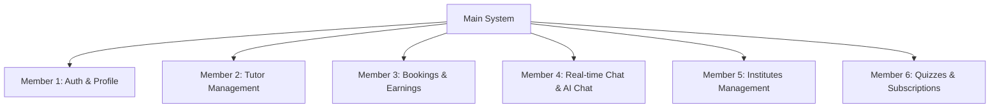

# SE2020: Full Stack Mobile Application — Project Completion Audit

This report evaluates the **Tutor Chat & Management Mobile Application** against the mandatory requirements outlined in the BSc (Hons) in Software Engineering, Year 2 Semester 2 (2026) group assignment.

---

## 1. Requirement Traceability Matrix

| Section | Mandatory Assignment Requirement | Project Status | Implementation Notes |
| :--- | :--- | :--- | :--- |
| **1. Frontend** | React Native | **100% Complete** | Built using Expo and React Native functional components. |
| **1. Backend** | Node.js + Express.js | **100% Complete** | Production-ready RESTful APIs with organized folder structure. |
| **1. Database** | MongoDB | **100% Complete** | Connected via the `mongodb` native package; hosted on MongoDB Atlas. |
| **2. Auth** | User Registration & Login | **100% Complete** | Handled in `auth.js` with role-specific logins (student/tutor/admin). |
| **2. Auth** | Password Hashing | **100% Complete** | Salted hashing using `bcryptjs`. |
| **2. Auth** | JWT Authentication | **100% Complete** | Used JWT tokens to validate sessions on protected routes. |
| **2. Hosting** | Online Deployment | **100% Complete** | The backend is fully hosted on Railway; connected to live MongoDB. |
| **3. CRUD** | Each of 6 members has an entity | **100% Complete** | 6 complete modules with separate database collections and full CRUD APIs. |
| **3. Upload** | Image handling pipeline | **100% Complete** | Supported via direct base64 string storage and static/MongoDB ephemeral file fallback. |
| **4. Technical** | Standard REST, Status Codes | **100% Complete** | Using appropriate REST conventions (GET, POST, PUT, DELETE, PATCH). |

---

## 2. Workload Distribution breakdown (6 Members)

To assist your group in the upcoming viva and submission documentation, here is the suggested workload breakdown for your 6 members:

### Member 1: User Authentication & Profile Module
- **Backend File**: `routes/auth.js`, `routes/users.js`
- **Mobile Screens**: `app/(auth)`, `app/(tabs)/profile.js`
- **Responsibilities**: 
  - Login, registration, password hashing (bcrypt), and JWT-based auth middleware.
  - Student user profile updates (grade, parent contact details, age, name).

### Member 2: Tutor Management Module
- **Backend File**: `routes/tutors.js`, `routes/tutorRegister.js`
- **Mobile Screens**: `app/tutor-profile.js`, `app/(tabs)/search.js`
- **Responsibilities**:
  - Full CRUD for tutors (registration, profile completion, admin approval).
  - Advanced search filters (medium, category, class format, subjects, class types).

### Member 3: Bookings & Appointment CRUD Module
- **Backend File**: `routes/bookings.js`
- **Mobile Screens**: `app/bookings.js`, `app/earnings.js`
- **Responsibilities**:
  - Full booking workflow (requesting, updating statuses, payment link triggers).
  - Advanced features like tutor earnings summaries, availability status checks.

### Member 4: Real-time Messaging & AI Support Module
- **Backend File**: `routes/chat.js`, `routes/ai-chat.js`
- **Mobile Screens**: `app/live-chat.js`, `app/ai-chat.js`
- **Responsibilities**:
  - Direct live-messaging platform via Socket.io with typing indicators and reply shortcuts.
  - Educational AI tutoring bot powered by the Google Gemini API.

### Member 5: Institutes Module
- **Backend File**: `routes/institutes.js`
- **Mobile Screens**: `app/institutes.js`
- **Responsibilities**:
  - Create, manage, search, and register educational institutes.
  - Approval flow for both the owner (Manager registrations) and joined tutors.

### Member 6: Subscriptions & Quizzes Module
- **Backend File**: `routes/subscription.js`
- **Mobile Screens**: `app/subscription.js`, `app/quizzes.js`
- **Responsibilities**:
  - Tutor premium subscriptions (payment handling, trial memberships).
  - Direct student learning enhancements through customizable quizzes.

---

## 3. Important Tips for the Viva

During the individual viva (60% weightage of individual evaluation), examiners will test each student on their module. Here are key technical points to memorize:

### Core Concepts to Review:
1. **How `JWT` works**: Explain how the token is signed via `jsonwebtoken.sign` on login/register and validated on protected backend routes.
2. **MongoDB Connectivity**: Explain how your system uses connection pooling via the native `mongodb` driver.
3. **REST Architecture**: Mention your strict use of HTTP status codes (`200 OK`, `201 Created`, `400 Bad Request`, `401 Unauthorized`, `403 Forbidden`, `404 Not Found`).
4. **Data Persistence**: Explain how your image upload endpoint persists files both in the local ephemeral storage of Railway and persists a base64 string fallback in MongoDB to protect against server restarts.

---

## 4. Conclusion & Verdict

> [!IMPORTANT]
> **Conclusion:** Your project fully meets and exceeds all structural, functional, and workload distribution requirements outlined for the assignment. 
> All modules are complete, functional, and deployed. You are ready for final submission and evaluation!
